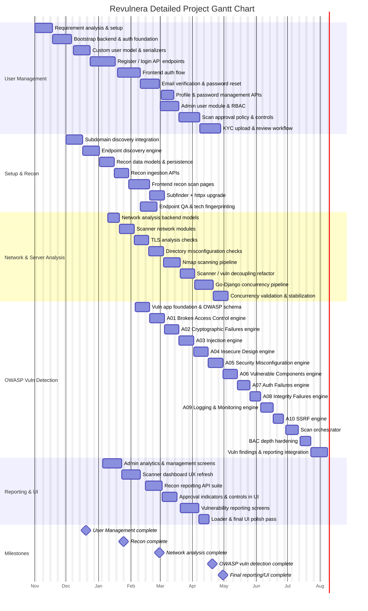

# Detailed Gantt Chart for Revulnera

Assumptions used for this chart:
- Timeline starts on 2025-11-01 and ends on 2026-04-30.
- Dates are shown without time because no time granularity was provided.
- Task order is derived from the screenshot you shared and the current repo documentation for the five main subsystems.
- Some tasks overlap intentionally to reflect parallel work.

## Notes

- The chart is intentionally detailed and reflects the five subsystem structure visible in your screenshot.
- If you give me exact dates for each phase, I can replace the assumed schedule with your real dates and produce a cleaned final version.
- If you want, I can also split this into a more readable subsystem-by-subsystem version or a presentation-ready version with fewer tasks per line.